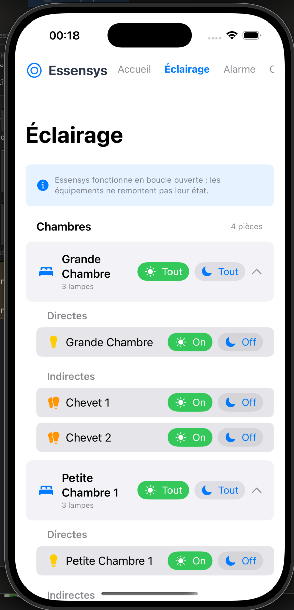
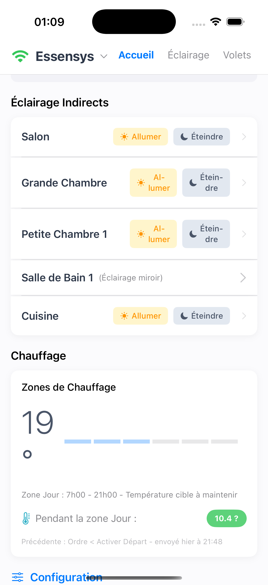
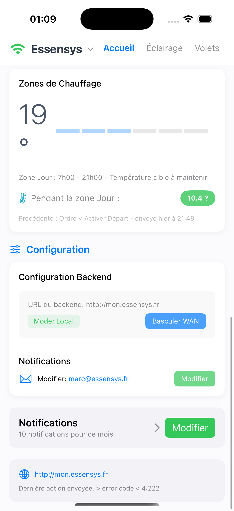

# Essensys iOS Application

Application iOS native pour contrôler le système Essensys depuis un iPhone.

## Table des Matières

- [Fonctionnalités](#fonctionnalités)
- [Prérequis Système](#prérequis-système)
- [Aperçu](#aperçu)
- [Configuration](#configuration)
- [Structure du Projet](#structure-du-projet)
- [Développement](#développement)

## Prérequis Système

Cette application nécessite une installation fonctionnelle du serveur Essensys sur un Raspberry Pi.
Veuillez vous référer au projet d'installation pour plus de détails :

- **Dépôt GitHub** : [essensys-hub/essensys-raspberry-install](https://github.com/essensys-hub/essensys-raspberry-install)
- **Documentation** : [Guide d'installation](https://essensys-hub.github.io/essensys-raspberry-install/)

## Fonctionnalités

### 🏠 Tableau de Bord (Accueil)
- Vue synthétique de l'état du système.
- **Scènes** : Activation rapide (Réveil, Soirée, Nuit, Départ).
- **Résumé Connexion** : Voir l'état de la connexion (Local/WAN) et basculer rapidement.

### 💡 Éclairage
- **Gestion Groupée** : Contrôle des lumières par pièce (Salon, Chambres, Cuisine, etc.).
- **Contrôle Rapide** : Boutons "Tout ouvrir" et "Tout fermer" pour agir sur tous les groupes.
- **Réorganisation** : Possibilité de réorganiser l'ordre des pièces via Drag & Drop (sauvegardé sur l'appareil).
- **Visualisation** : Indicateurs pour lumières directes et indirectes.

### 🪟 Volets
- Contrôle des volets roulants par pièce.
- Actions : Monter, Stop, Descendre.

### 🔧 Configuration & Connexion
- **Double Mode** :
  - **Local (WiFi)** : Connexion directe sans authentification (ex: `http://mon.essensys.fr`).
  - **WAN (Extérieur)** : Connexion sécurisée avec authentification Basic Auth (Nom d'utilisateur/Mot de passe).
- **Switch Rapide** : Basculez entre Local et WAN directement depuis l'en-tête de l'application (Menu logo Essensys) ou depuis l'écran d'accueil.

## Aperçu

| Accueil & Scènes | Éclairage (Groupé) | Volets |
|:---:|:---:|:---:|
|  |  |  |

## Configuration

Pour configurer l'application :

1. Aller dans l'onglet **Configuration**.
2. Remplir les champs :
   - **URL Locale** : Adresse sur le réseau WiFi (ex: `http://192.168.1.101`).
   - **URL WAN** : Adresse pour l'accès extérieur.
   - **Nom d'utilisateur** : (Optionnel, "user" par défaut).
   - **Mot de passe WAN** : Requis pour l'accès extérieur.
3. Utiliser le bouton "Basculer" ou le menu en haut à gauche pour changer de mode.

## Structure du projet

```
EssensysApp/
├── essensys-iphone/
│   ├── Views/
│   │   ├── HomeView.swift           # Dashboard
│   │   ├── LightingView.swift       # Contrôle éclairage (Reorderable List)
│   │   ├── ShuttersView.swift       # Contrôle volets
│   │   ├── ConfigurationView.swift  # Paramètres
│   │   └── SharedComponents.swift   # Composants UI (Header, Banner, etc.)
│   ├── Services/
│   │   ├── ConnectionManager.swift  # Gestion état connexion & Auth
│   │   └── EssensysAPI.swift        # Appels API (Injection commandes)
│   └── Models/                      # Modèles de données (Config, Lighting, etc.)
```

## Développement

### Prérequis
- Xcode 14.0+
- iOS 15.0+

### Installation
1. Ouvrir `essensys-iphone.xcodeproj`.
2. Sélectionner la target `essensys-iphone`.
3. Compiler et lancer (`Cmd + R`).

### API Backend
L'app communique avec le système via :
- `GET /api/serverinfos` : Vérification de la connexion.
- `POST /api/admin/inject` : Envoi des commandes (indices k/v).

---
*Note : L'application fonctionne en boucle ouverte pour certaines commandes, l'état affiché est celui supposé après action.*
