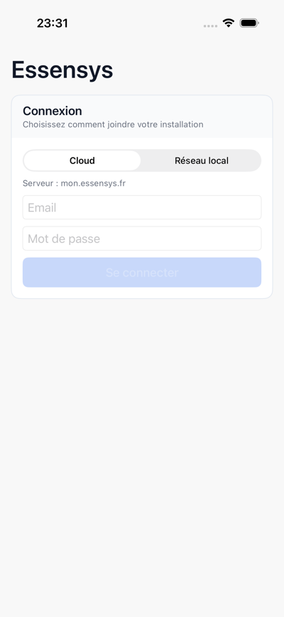
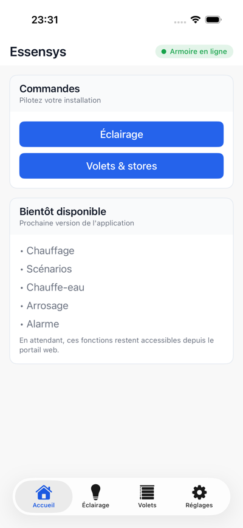
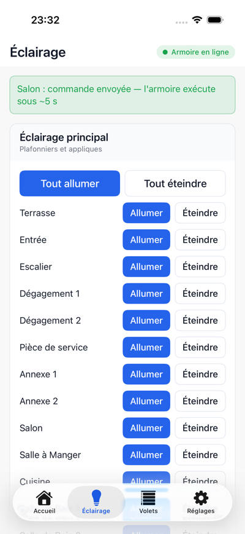
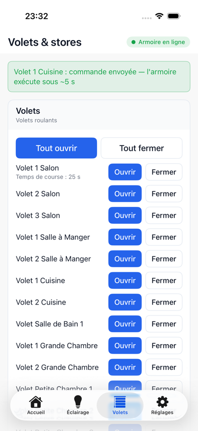
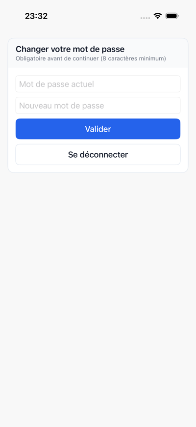
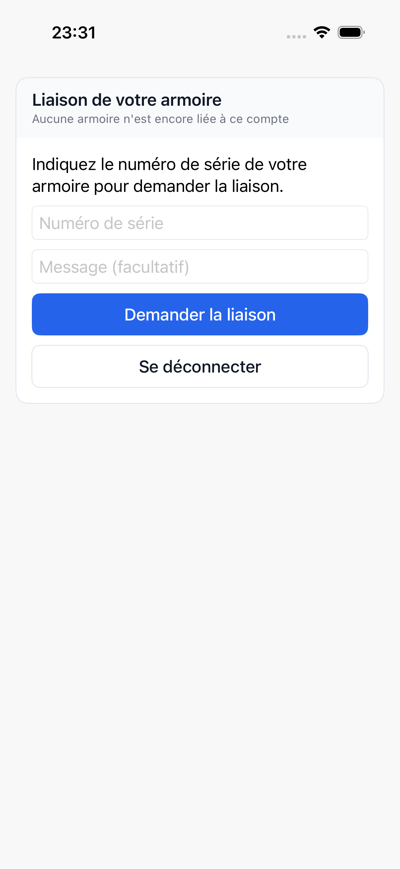
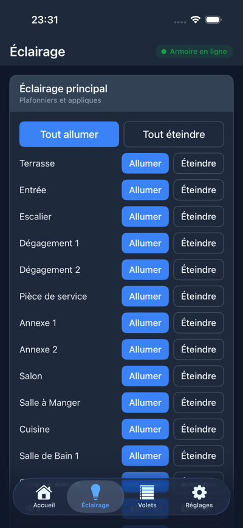
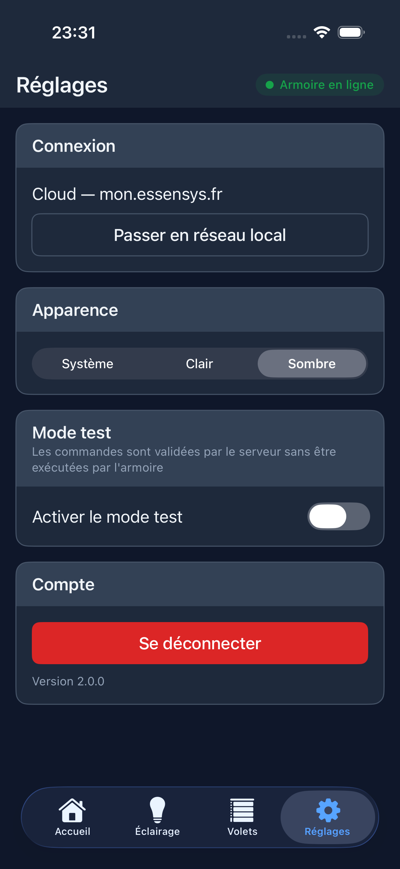

# Essensys iPhone

L'application iPhone officielle pour piloter une installation domotique Essensys. Elle reprend l'apparence et le fonctionnement du portail web, en **cloud** (`mon.essensys.fr`) ou directement sur le **réseau local** (gateway `mon.essensys.local`). C'est la jumelle de l'[app Android v2.0.0](https://github.com/essensys-hub/essensys-android-phone-apps) : mêmes écrans, mêmes commandes.

> **Version 2.0.0** (change OpenSpec `ios-portal-refresh-2026-10-003`, ticket [essensys-feature-lifecycle#13](https://github.com/essensys-hub/essensys-feature-lifecycle/issues/13)). Refonte complète de la v1.

## Fonctionnalités (V1)

- **Connexion cloud** avec votre compte du portail (email et mot de passe), y compris le changement obligatoire d'un mot de passe temporaire.
- **Connexion réseau local** directement à la gateway, en HTTPS uniquement. Le certificat de la gateway est confirmé une seule fois, à la première connexion.
- **Liaison de l'armoire** : un compte sans armoire liée peut demander la liaison depuis l'application.
- **Éclairage** : par pièce, éclairage principal et indirect, « tout allumer » et « tout éteindre ».
- **Volets et stores** : par volet, par groupe ou tous, avec le temps de course configuré.
- **État de l'armoire** (en ligne ou hors ligne) et **dernière action** en cloud. Les commandes sont désactivées quand l'armoire est hors ligne.
- **Mode test** : le serveur valide les commandes sans que l'armoire les exécute.
- **Thème** Système, Clair ou Sombre, avec la charte du portail.

Le chauffage, les scénarios, le chauffe-eau, l'arrosage et l'alarme arrivent dans la prochaine version. En attendant, ils restent accessibles depuis le portail web.

## Aperçu

| Connexion | Accueil | Éclairage | Volets |
|---|---|---|---|
|  |  |  |  |

| Mot de passe temporaire | Liaison armoire | Éclairage (sombre) | Réglages (sombre) |
|---|---|---|---|
|  |  |  |  |

## Installation (testeurs, via TestFlight)

1. Installez l'application **TestFlight** depuis l'App Store (gratuite, éditée par Apple).
2. Ouvrez l'**invitation** reçue par email depuis votre iPhone, puis appuyez sur **Voir dans TestFlight** et **Accepter**.
3. Dans TestFlight, appuyez sur **Installer** à côté de **Essensys**. Les mises à jour arrivent ensuite automatiquement.
4. Ouvrez l'application et choisissez le mode de connexion :
   - **Cloud** (recommandé) : connectez-vous avec le compte de votre portail `mon.essensys.fr`.
   - **Réseau local** : à utiliser chez vous, sur le Wi-Fi de l'installation. Adresse par défaut : `https://mon.essensys.local`. À la première connexion, l'application affiche l'**empreinte du certificat de la gateway**. Comparez-la avec celle que vous a transmise l'installateur, puis confirmez seulement si elle est identique.
5. Le badge vert **« Armoire en ligne »** confirme que votre installation est reliée. Après chaque appui, l'application confirme l'envoi, et l'armoire exécute la commande en environ 5 secondes.

Si vous aviez installé l'ancienne version (v1), vous pouvez la supprimer. Ses identifiants, qui étaient stockés en clair, sont effacés par la v2.

## Développement

Swift 6 (concurrence stricte) et SwiftUI, iOS 18 minimum, Xcode 26.6. Le projet se trouve dans `EssensysApp/essensys-iphone/essensys-iphone.xcodeproj`.

### Prérequis

- Xcode 26.6 avec la plateforme iOS 26.5 (`xcodebuild -downloadPlatform iOS`).
- Si `simctl` bloque ou que Xcode signale « CoreSimulator is out of date », lancez une fois `sudo xcodebuild -runFirstLaunch`.

### Commandes

```bash
cd EssensysApp/essensys-iphone
xcodebuild -project essensys-iphone.xcodeproj -scheme essensys-iphone \
  -destination 'platform=iOS Simulator,name=iPhone 17' test
```

- **Tests unitaires** (Swift Testing) : la couche data est testée contre un backend simulé (`URLProtocol`, hôtes `*.essensys.test`).
- **Tests UI** (XCUITest) : l'app tourne avec un backend simulé embarqué (`UITEST_BACKEND=1`, builds DEBUG seulement).

Les tests ne pilotent **jamais** une armoire réelle : `NoArmoireGuard` fait échouer toute commande envoyée vers un hôte réel.

Les tests de non-régression portent l'identifiant `NR-ios-<n>` et la référence de leur issue. Ils reprennent les mêmes couples (k, v) que l'Android, et se consolident avec :

```bash
python3 ../essensys-feature-lifecycle/scripts/feature_lifecycle/xcresult_to_junit.py <résultat>.xcresult --out junit/unit.xml
python3 ../essensys-feature-lifecycle/scripts/feature_lifecycle/nonreg_report.py --sources EssensysApp/essensys-iphone \
  --out nonreg.json --markdown nonreg.md junit
```

### Architecture

| Dossier | Rôle |
|---|---|
| `Data/HTTP` | `APIClient` (async/await), erreurs normalisées, garde no-armoire, TLS épinglé en LAN (`LanTrust`) |
| `Data/Auth` | Connexion cloud (JWT) et LAN (cookie de session), changement de mot de passe, déconnexion |
| `Data/Control` | `IndexTable` (indices et masques du portail, verrouillés par les tests NR) et envoi des commandes |
| `Data/Session` | Session (Keychain, purge de la configuration v1), liaison, état de la gateway, dernière action |
| `UI` | Thème du portail, composants, écrans, modèles observables |
| `Debug` | Backend simulé pour les tests UI (DEBUG uniquement) |

Gouvernance : chaque modification part d'un ticket du [GitHub Project Essensys](https://github.com/orgs/essensys-hub/projects/6), voir `essensys-feature-lifecycle/claude/GOVERNANCE.md`.

Les documents `INDICES.md`, `LAMPES_LISTE.md`, `SETUP.md`, `STRUCTURE.md`, `TROUBLESHOOTING.md` et `VERIFICATION.md` décrivent la **v1** et sont conservés pour l'historique.
